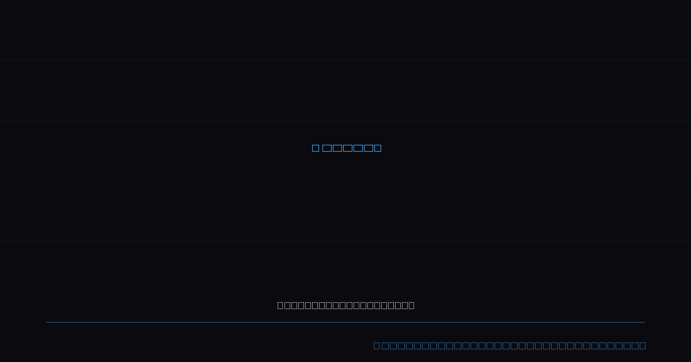
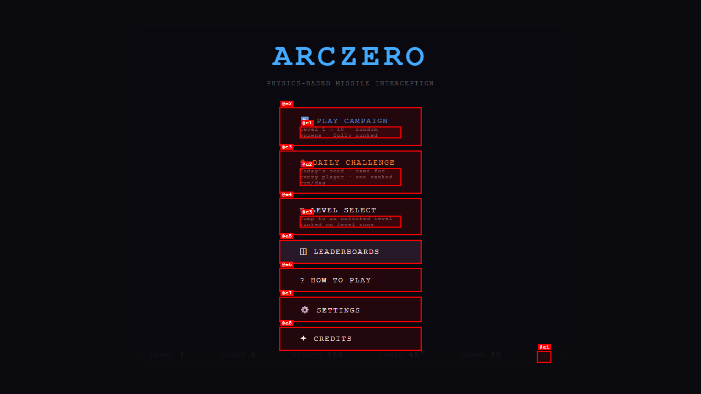
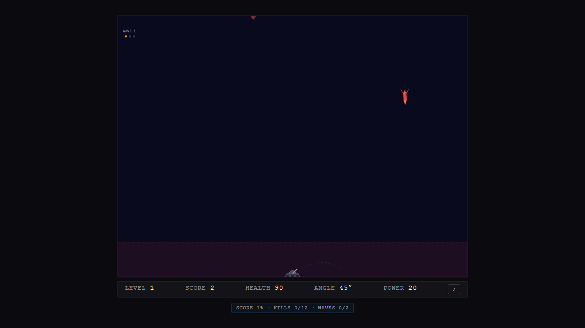
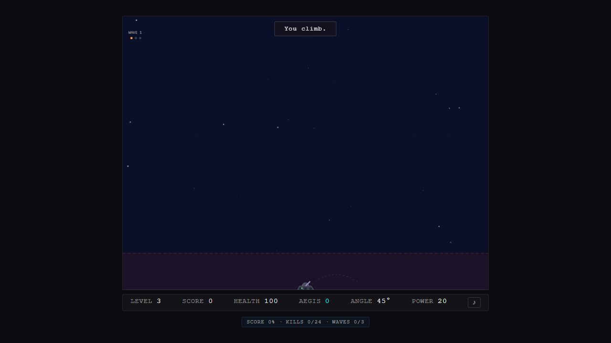
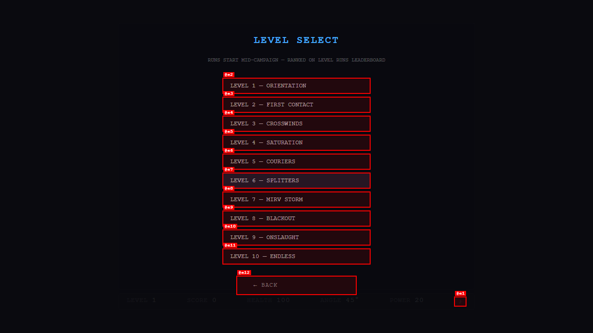
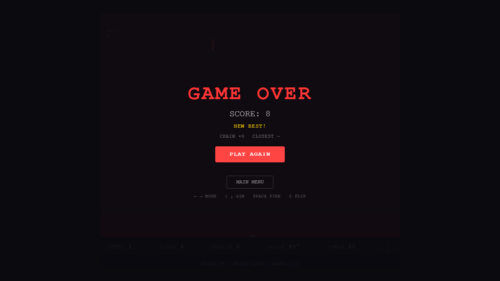

<div align="center">



<br/>

# ARCZERO

**Calculate the arc. Fire the interceptor. Survive the onslaught.**

A browser-based 2D ballistic arcade game — no frameworks, no libraries, pure physics.

<br/>

[](https://developer.mozilla.org/en-US/docs/Web/JavaScript/Guide/Modules)
[](https://vitejs.dev/)
[](https://supabase.com/)
[](https://vitest.dev/)
[](LICENSE)

<br/>

[**▶ Play Now**](https://arczero.app) &nbsp;·&nbsp; [Report Bug](https://github.com/NiruddeshJatra/ArcZero/issues) &nbsp;·&nbsp; [Source](https://github.com/NiruddeshJatra/ArcZero)

</div>

---

## Overview

ArcZero is a physics-first missile interception game that runs entirely in the browser — no game engine, no framework. You control a ground-based launcher and must calculate ballistic arcs to intercept incoming enemy missiles before they reach the ground.

The simulation runs on a **fixed 20-tick/second physics engine** with real gravity, angle-dependent launch vectors, and power-charged shots. Scoring rewards skill — high-altitude kills, shallow-angle shots, last-second clutch interceptions, and combo chains all multiply your base points. Ten escalating levels culminate in a true endless survival mode with per-wave difficulty ramp.

Global leaderboards are backed by **Supabase Edge Functions** with HMAC-signed run tokens and server-side plausibility checks, so ranks are earned, not forged.

---

## Screenshots

<table>
  <tr>
    <td align="center">
      
      <br/><sub><b>Main Menu</b></sub>
    </td>
    <td align="center">
      
      <br/><sub><b>Live Gameplay — Level 1</b></sub>
    </td>
  </tr>
  <tr>
    <td align="center">
      
      <br/><sub><b>Level 3 — Crosswinds · Aegis Active</b></sub>
    </td>
    <td align="center">
      
      <br/><sub><b>Level Select — All 10 Levels</b></sub>
    </td>
  </tr>
  <tr>
    <td align="center" colspan="2">
      
      <br/><sub><b>Game Over — Personal Best</b></sub>
    </td>
  </tr>
</table>

---

## Features

- **Custom Ballistic Physics** — Real gravity (`g = −12 m/s²`), angle-controlled shots, power-charged launches, and a fixed 20-tick timestep that stays frame-independent across any refresh rate.
- **Skill-Based Scoring** — Multipliers for altitude, shot angle, clutch kills (missile below 35 m), long-range hits, and combo chains up to ×10. No score inflation through volume alone.
- **Four Missile Types** — Standard, Courier (fast, high value), Splitter (forks at 60 m), and MIRV (splits into 3 spread warheads after 1.5 s).
- **Aegis Energy System** — Build energy through near-misses and intercepts; trigger an EMP that clears all missiles on screen.
- **Three Game Modes** — Campaign (progressive, fully ranked), Daily Challenge (seeded — same spawns for every player worldwide), and Level Select (endless survival, per-level leaderboard).
- **Global Leaderboards** — Real-time daily and all-time boards powered by Supabase. One best score per player per day. HMAC-SHA256 anti-cheat tokens with server-side plausibility validation.
- **Full Mobile Support** — Touch-optimized 6-button control layout with hold-to-charge fire mechanic, portrait-mode canvas, and device-conditional world geometry.
- **Audio Engine** — Web Audio API with 20+ sound slots — intercept, near-miss, missile impact, Aegis EMP, and more. Per-session mute and persistent volume control.

---

## Game Modes

| Mode | Start | Ranking | Advances? |
|------|-------|---------|-----------|
| **Campaign** | Level 1 | All-time global | Yes — L1 → L10 |
| **Daily Challenge** | Level 1 | Daily global (one ranked attempt) | Yes — same seed for all players |
| **Level Select** | Any unlocked level | Per-level global | No — endless survival |

**Level unlock:** Campaign and Daily play unlocks levels for Level Select. In Level Select, meeting all three advancement gates (score threshold + intercept count + waves completed) unlocks the next level permanently.

---

## How to Play

### Desktop Controls

| Key | Action |
|-----|--------|
| `← →` | Move launcher left / right |
| `↑ ↓` | Adjust aim angle |
| `Space` (hold) | Charge launch power |
| `Space` (release) | Fire interceptor |
| `Z` | Flip launcher direction |
| `P` / `Esc` | Pause |
| `M` | Toggle mute |

**Tip:** Hold `Space` longer for more power. Watch the angle — shallow shots score more. Intercept missiles high up for maximum altitude multiplier.

### Mobile Controls

The launcher control strip sits below the canvas. All controls are hold-to-repeat except Flip, which toggles on tap.

| Button | Action |
|--------|--------|
| `◄` (hold) | Move launcher left |
| `►` (hold) | Move launcher right |
| `▲` (hold) | Aim upward |
| `▼` (hold) | Aim downward |
| `●` (hold → release) | Hold to charge power, release to fire |
| `⇄` (tap) | Flip launcher direction |

**Mobile tip:** The `●` fire button works exactly like `Space` on keyboard — the longer you hold, the more power your shot carries. Tap quickly for low-power precision shots, hold for long-range salvos.

---

## Levels

| # | Name | Character |
|---|------|-----------|
| 1 | Orientation | Straight falls only — learn the arc |
| 2 | First Contact | Missiles fall faster |
| 3 | Crosswinds | Lateral drift introduced |
| 4 | Saturation | Simultaneous missile cap begins |
| 5 | Couriers | Fast gold-streak couriers appear |
| 6 | Splitters | Missiles fork at 60 m |
| 7 | MIRV Storm | Triple-warhead MIRV barrages |
| 8 | Blackout | Trajectory display disabled |
| 9 | Onslaught | Mixed types, maximum density |
| 10 | Endless | Per-wave escalation — no ceiling |

---

## Tech Stack

| Layer | Technology |
|-------|-----------|
| Language | JavaScript (ES Modules) — no transpilation, no TypeScript in game core |
| Renderer | HTML5 Canvas 2D API |
| Build tool | Vite 5 |
| Backend | Supabase (PostgreSQL, Row-Level Security, Edge Functions on Deno) |
| Auth / Anti-cheat | HMAC-SHA256 signed run tokens (Web Crypto API) |
| Unit tests | Vitest + happy-dom |
| E2E tests | Playwright (desktop + Pixel 5 mobile) |
| Linting | ESLint + Prettier |
| Asset gen | sharp (OG image + favicons at build time) |

---

## Dependencies

### Runtime

| Package | Version | Purpose |
|---------|---------|---------|
| `@supabase/supabase-js` | `^2.107.0` | Leaderboard reads via PostgREST |
| `@vercel/analytics` | `^2.0.1` | Lightweight page analytics |

### Development

| Package | Purpose |
|---------|---------|
| `vite` | Dev server + production bundler |
| `vitest` | Unit test runner |
| `@playwright/test` | E2E browser automation |
| `eslint` | Static analysis (bans `Math.random()`, direct `localStorage` access) |
| `prettier` | Code formatting |
| `sharp` | Build-time image generation |
| `happy-dom` | Fast DOM environment for unit tests |

---

## Getting Started

### Prerequisites

- **Node.js** 18+ and **Yarn** 4+
- A [Supabase](https://supabase.com/) project (free tier works) — for leaderboards. The game runs fully offline without it.

### 1. Clone the repository

```bash
git clone https://github.com/NiruddeshJatra/ArcZero.git
cd ArcZero
```

### 2. Install dependencies

```bash
yarn install
```

### 3. Configure Supabase *(optional — skip to play offline)*

Edit `src/net/config.js` and replace the placeholder values with your Supabase project URL and anon key:

```js
export const SUPABASE_URL = 'https://your-project.supabase.co';
export const SUPABASE_ANON_KEY = 'your-anon-key';
```

Then apply the schema in your Supabase SQL editor:

```bash
# Paste the contents of supabase/schema.sql into the Supabase SQL editor and run it.
# Then deploy the Edge Functions:
supabase functions deploy start_run --project-ref your-project-ref
supabase functions deploy submit_score --project-ref your-project-ref
```

### 4. Start the dev server

```bash
yarn dev
```

Open [http://localhost:5173](http://localhost:5173) in your browser.

### 5. Run tests

```bash
yarn test          # Vitest unit tests (160 tests)
yarn test:e2e      # Playwright E2E (requires running dev server)
yarn lint          # ESLint check
```

### Build for production

```bash
yarn build         # Outputs to dist/
yarn preview       # Preview the production build locally
```

---

## Project Structure

```
src/
├── main.js         — Bootstrap, menu wiring, game-over flow
├── gameLoop.js     — Fixed-timestep loop, level advancement
├── physics.js      — Ballistic simulation, MIRV/splitter splits
├── collision.js    — Hit detection, combo scoring, near-miss
├── renderer.js     — Canvas drawing, HUD, overlays
├── constants.js    — Single source of truth for all numbers
├── levels.js       — Per-level config, portrait derivation
├── aegis.js        — Aegis energy system
├── spawner.js      — Missile spawn timing and type selection
├── audio.js        — Web Audio API integration
├── rng.js          — Seeded PRNG (mulberry32)
├── persistence.js  — localStorage save/load
└── net/            — Supabase client, identity, leaderboard API
supabase/
├── schema.sql                    — Table + views + RLS
├── migrations/0002_dedup_views.sql
└── functions/
    ├── start_run/index.ts        — HMAC token issuance
    └── submit_score/index.ts     — Token verify + plausibility + insert + rank
```

---

## Links

| | |
|-|-|
| 🎮 **Live Game** | [arczero.app](https://arczero.app) |
| 🐛 **Bug Reports** | [GitHub Issues](https://github.com/NiruddeshJatra/ArcZero/issues) |
| 📦 **Repository** | [github.com/NiruddeshJatra/ArcZero](https://github.com/NiruddeshJatra/ArcZero) |

---

<div align="center">

Built with vanilla JS and a fixed-timestep physics loop. No game engine required.

</div>
